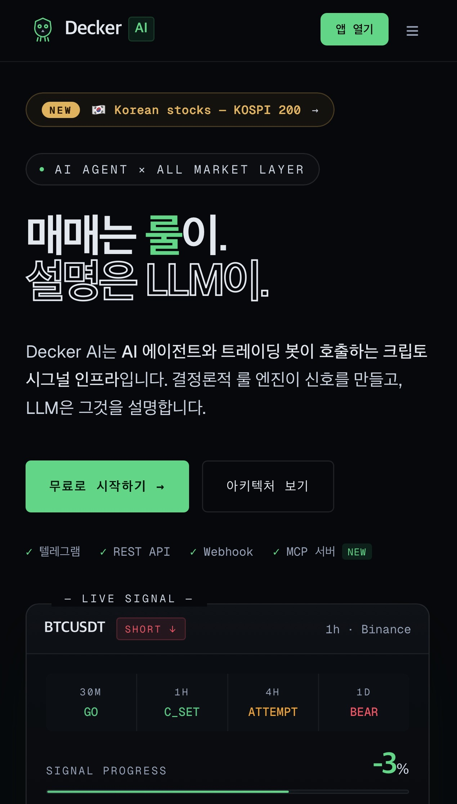
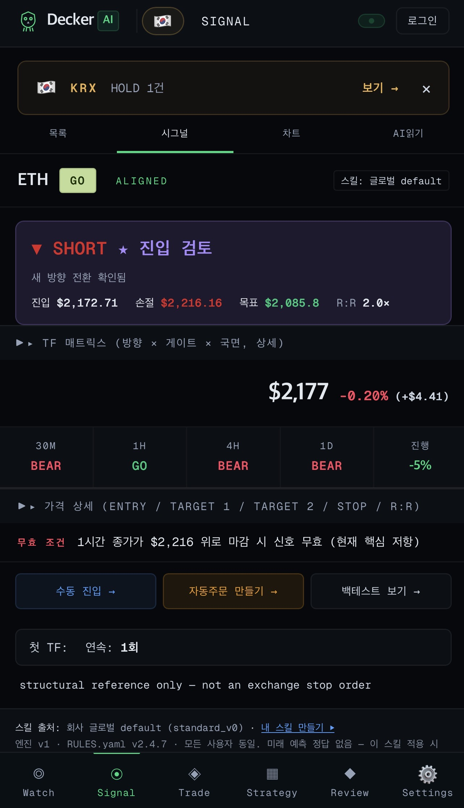
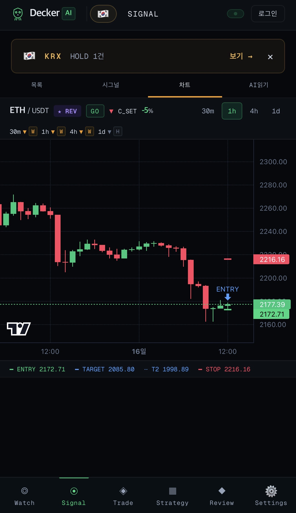
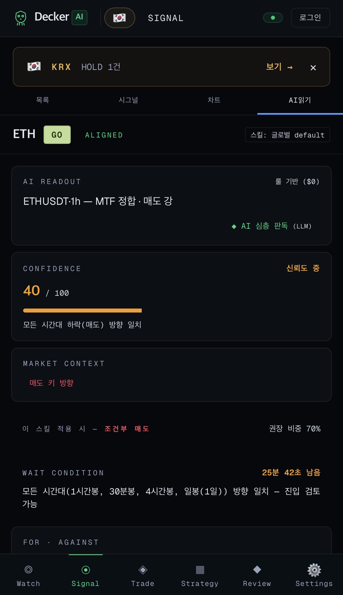
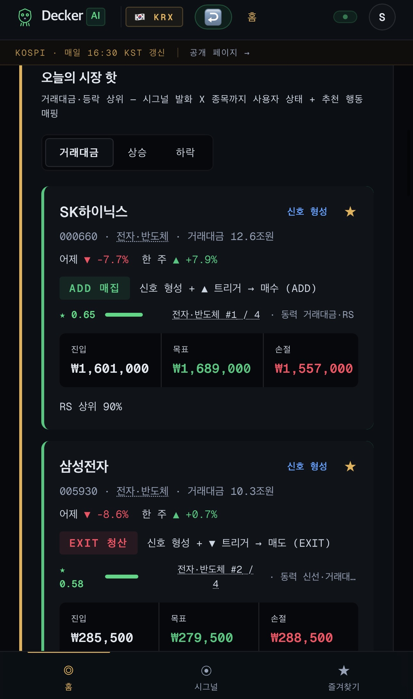
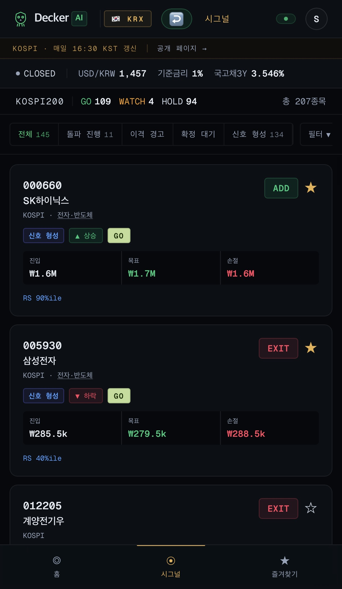
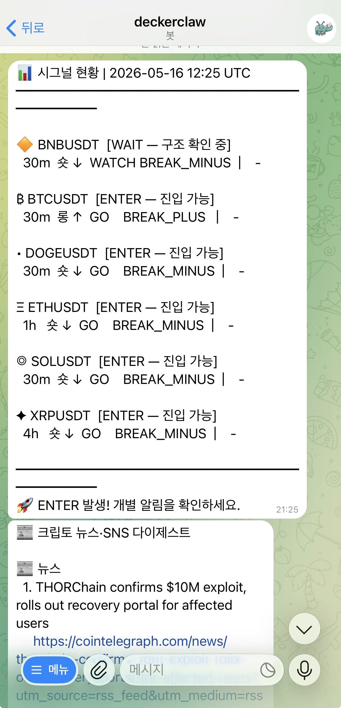
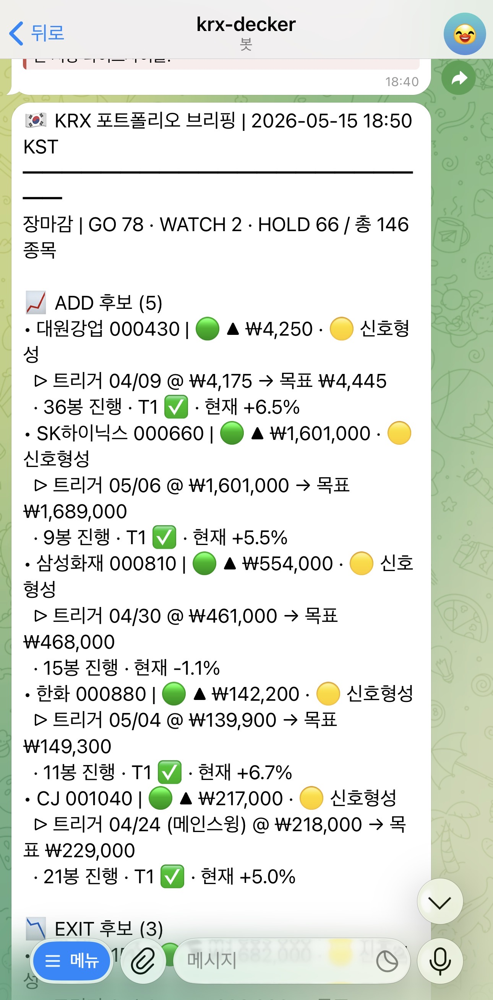
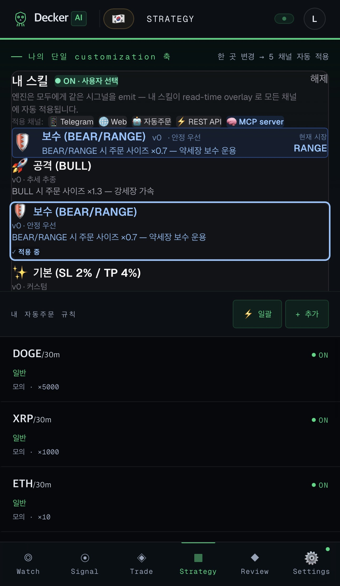
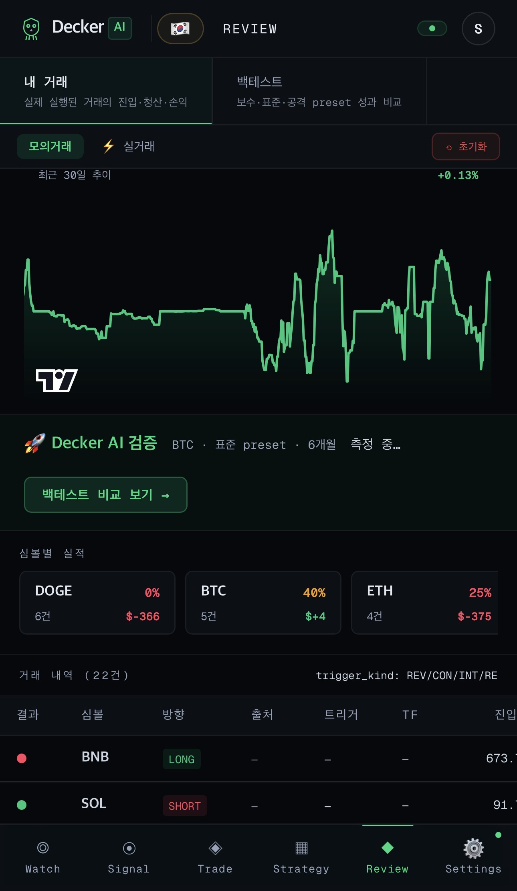

<!--
  Keywords: AI trading signal, crypto market state engine, structural analysis,
  algorithmic trading API, Telegram trading bot, Python SDK, decker-client,
  deterministic signal, progress_pct, operation rules, GO WATCH HOLD, KRX, KOSPI
-->
<div align="center">


# Decker AI

### A market structure engine — not another buy/sell bot.

**Crypto + Korean equities (KRX).** Every signal is deterministic, traceable, and explained in plain language.

[Open the app](https://decker-ai.com) · [Telegram bot](https://t.me/deckerclawbot) · [Kakao channel](https://pf.kakao.com/_RxlxjVX) · [API docs](https://api.decker-ai.com/docs)

[](https://decker-ai.com)
[](https://t.me/deckerclawbot)
[](https://pf.kakao.com/_RxlxjVX)
[](https://api.decker-ai.com/docs)
[](https://api.decker-ai.com/api/v1/mcp/health)
[](LICENSE)



</div>

---

## What you get

- **Signals you can act on, with context.** Not "BUY" — `GO / WATCH / HOLD` + `progress_pct` (0–100% lifecycle) + entry / stop / target.
- **It explains itself.** Every signal has a structural cause (multi-timeframe alignment, state machine phase) that an LLM translates into plain language.
- **Same engine, two markets.** Crypto (24/7) + Korean equities (KOSPI + KOSDAQ, Beta).
- **Use it your way.** Web app, Telegram, Kakao channel, REST API, or MCP server inside Claude / Cursor.

> *"Where are we in the current structural cycle — and what's the next optimal move?"*

---

## Get started in 60 seconds

| Path | Best for | Start |
|------|---------|-------|
| 📱 **Web app** | Most people — full dashboard, mock trading, KRX watchlist | **[decker-ai.com](https://decker-ai.com)** — sign up free |
| 🤖 **Telegram bot** | Quick signal checks on your phone | **[@deckerclawbot](https://t.me/deckerclawbot)** — `/start` |
| 💛 **Kakao channel** | 한국 사용자, KRX 시그널 알림 | **[pf.kakao.com/_RxlxjVX](https://pf.kakao.com/_RxlxjVX)** |
| 🧠 **MCP server** | Claude / Cursor / Codex users | [MCP setup](#mcp-server-claude--cursor--codex) |
| 🛠 **REST API** | Developers building bots & apps | [API quickstart](#api-quickstart-3-steps) |

> Free tier is generous (30 calls/day on the API; Web + Telegram included). During Beta, signed-up users get **PRO access for free**.

---

## See it in action

### Live signals — multi-timeframe, with a plain-language reading

<div align="center">



</div>

You get the structural state (state machine phase), the multi-timeframe alignment, the entry / stop / target, and a short reading that explains *why* — not just *what*.

### Korean equities (KRX) — Beta, free

<div align="center">


</div>

Same deterministic engine, applied to KOSPI + KOSDAQ. Portfolio actions instead of buy/sell: **ADD / HOLD / REDUCE / EXIT**. Universe = top 200 by trading value ∪ your watchlist ∪ momentum / volume spikes.

### Telegram channels — alerts that show the *whole picture*

<div align="center">


</div>

Not a stream of single-symbol alerts — a periodic briefing across all symbols you care about. Crypto majors via [@deckerclawbot](https://t.me/deckerclawbot), KRX end-of-day via [@krxdeckerbot](https://t.me/krxdeckerbot).

### Strategy presets + review your own performance

<div align="center">


</div>

Pick a **Skill Overlay** (`conservative` / `standard` / `aggressive`) — it applies everywhere (Web, Telegram, API, MCP). Review your own trades against the engine's signals to see what worked.

---

## Three things that make it different

**1. `progress_pct` — every signal has a lifecycle.**
A signal at 25% progress is a different trade than the same signal at 80%. Most tools just say "BUY"; Decker tells you *where in the move you are*.

```
Entry                                                           Target
  0%──────────33%──────────50%──────────67%──────────83%────────100%
 Wait       Entry        Active       Late TP      Final TP     Exit
```

**2. `GO / WATCH / HOLD` — three gates, not binary.**
| Gate | Meaning |
|------|---------|
| **GO** | Structure confirmed — entry conditions met |
| **WATCH** | Signal forming — monitor, no entry yet |
| **HOLD** | Active position — no new entry signal |

> `WATCH` is the gate most tools skip. It's why users enter too early.

**3. Deterministic + traceable. LLM explains, doesn't decide.**
| | Typical AI signal | Decker |
|---|---|---|
| Source | ML / LLM price prediction | Deterministic state machine |
| Output | BUY / SELL | `progress_pct` + `operation_gate` + ranked choices |
| LLM role | Makes the call | **Explains the structural state** |
| Auditability | ❌ Black box | ✅ Every signal has a `trace_id` |
| Cost per signal | High | **$0 on the rules path** |
| Reproducibility | ❌ | ✅ Same input → same output, always |

---

## Pricing

| Tier | Price | Daily API limit | MCP | Auto-trade |
|------|-------|-----------------|-----|------------|
| **FREE** | $0 forever | 30 calls/day | read-only (1d cache) | ❌ |
| **PRO** | $20 / mo · 7-day trial | 10,000 / day | full (4 tools) | virtual + real |
| **ENTERPRISE** | Contact us | 100,000+ / day · custom | full + per-org skill catalog | + custom integration |

> **Beta (now):** all authenticated users get **PRO for free** via `BETA_TIER_OVERRIDE=PRO`. No payment required.

Web sign-up and Telegram bot are always free for the basics.

---

## ⚡ Try the API right now (no sign-up)

```bash
curl https://api.decker-ai.com/api/v1/public/demo
```

Returns a live BTCUSDT 1h signal — no API key needed.

---

## API quickstart (3 steps)

**1. Get your API key** — open [@deckerclawbot](https://t.me/deckerclawbot) → `/start` → `/apikey`.

**2. First call**
```bash
curl "https://api.decker-ai.com/api/v1/public/signals/BTCUSDT/latest?timeframe=1h" \
  -H "X-API-Key: dk_live_xxx"
```

```json
{
  "symbol": "BTCUSDT",
  "timeframe": "1h",
  "direction": "long",
  "entry_price": 94200.0,
  "target_price": 97500.0,
  "stop_loss": 92800.0,
  "progress_pct": 67.3,
  "operation_gate": "GO",
  "generated_at": "2026-04-23T05:00:00Z"
}
```

**3. Python SDK (optional)**
```bash
git clone https://github.com/gigshow/decker-ai.git
pip install -e decker-ai/sdk/python/
```

```python
from decker_client import Client

with Client(api_key="dk_live_xxx") as client:
    sig = client.signals.get_latest("BTCUSDT", timeframe="1h")
    print(f"{sig.direction} | entry={sig.entry_price} | progress={sig.progress_pct}%")
```

> Full developer reference: **[DEVELOPER_API_GUIDE.md](docs/DEVELOPER_API_GUIDE.md)** — auth, rate limits, SDK, FAQ.

---

## MCP Server (Claude / Cursor / Codex)

Add Decker to any [MCP-compatible](https://modelcontextprotocol.io/) AI agent.

```json
{
  "mcpServers": {
    "decker-ai": {
      "url": "https://api.decker-ai.com/api/v1/mcp/sse",
      "headers": { "X-API-Key": "dk_live_xxx" }
    }
  }
}
```

**4 tools** (auto-applies your Skill Overlay):

| Tool | Purpose |
|------|---------|
| `decker.get_signals` | Active MTF consumer signals (filter by symbol / min progress / gate) |
| `decker.get_reading` | AI reading view (state · MTF · risk · narrative) |
| `decker.get_user_skills` | Catalog of trading skills + active overlay |
| `decker.set_skill_overlay` | Switch overlay on the fly |

Spec: [docs/mcp-server.md](docs/mcp-server.md).

---

## How the engine works (one diagram)

```
Raw OHLCV candles
  ↓  Sequence Labeler  →  every candle gets a role (anchor / test / signal)
  ↓  State Machine     →  C_SET → B_FORMING → B_SET → A_FORMING → W_PENDING
  ↓  Operation Gate    →  GO · WATCH · HOLD
  ↓  RULES Engine      →  9-layer YAML rulebook → strategy + ranked choices
  ↓  AI Consultation   →  LLM translates structural state → plain language
  ↓
"67% progress. B-leg confirmed. Recommended: 30% partial TP or hold to target."
```

**No price prediction. No black box. Every output traces to a formal structural cause.**

Deep dives: [Sequence Engine](concept/sequence_engine.md) · [Labeling Algorithm](concept/labeling_algorithm.md) · [Market State Theory](concept/market_state_theory.md)

---

## Supported symbols

**Crypto (GA):** `BTCUSDT` · `ETHUSDT` · `SOLUSDT` · `BNBUSDT` · `XRPUSDT` · `DOGEUSDT` — timeframes `30m`, `1h`, `4h`, `1d`.

**KRX (Beta, free):** KOSPI 948 + KOSDAQ 1,822 = **2,770 tickers**. Universe = top 200 by trading value ∪ user watchlist ∪ momentum spike ∪ volume spike. Timeframe `1d` only (1w expanding). Daily evaluation at 16:30 KST.

KRX details: [`docs/krx/KRX_BUSINESS_MODEL_AND_ROADMAP_2026-05-09.md`](docs/krx/KRX_BUSINESS_MODEL_AND_ROADMAP_2026-05-09.md).

---

## Performance

*Backtest results on the rules path. Past performance does not guarantee future results.*

| Metric | Result | Condition |
|--------|--------|-----------|
| Win Rate | 61–75% | Ranging market |
| Win Rate | 70%+ | Trending market |
| Avg Profit | 4–10% | Per signal |
| Avg Loss | 1–2% | Tight stop-loss |
| Max Drawdown | < 9% | Capital preservation |
| Signal Frequency | 1–3 / day | Per symbol |

Details: [Signal Performance](docs/signal-performance.md).

---

## Docs

| | |
|--|--|
| **[Developer API Guide](docs/DEVELOPER_API_GUIDE.md)** | Auth · rate limits · SDK · FAQ — **start here if you're building** |
| [Quick Start](docs/quickstart.md) | 3-step guide per path |
| [API Guide](docs/api-guide.md) | Full endpoint reference |
| [Architecture](docs/architecture.md) | Pipeline, state engine, modules |
| [Model & Algorithm](docs/model.md) | How the signal engine works |
| [Operation Rules](operation_rules/RULES.yaml) | Open YAML rulebook (v2.4.7+) |
| [Article Series (1–15)](docs/medium/README.md) | Deep dives on Medium |
| [Roadmap](docs/roadmap.md) | What's next |
| [llms.txt](llms.txt) | LLM/AI agent discovery manifest |

---

## Links

| | |
|-|-|
| **Web app** | https://decker-ai.com |
| **API docs** | https://api.decker-ai.com/docs |
| **Telegram bot (crypto)** | https://t.me/deckerclawbot |
| **Telegram bot (KRX)** | https://t.me/krxdeckerbot |
| **Kakao channel** | https://pf.kakao.com/_RxlxjVX |
| **X / Twitter** | https://x.com/blockoceandev |

---

> This repository is the **public hub** for Decker AI — SDK, samples, rulebook, architecture docs, OpenClaw skill packages.
> Production application code runs in a private monorepo. All listed endpoints, channels, and the web app are live.
