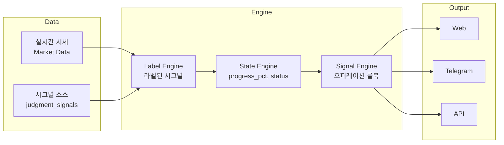
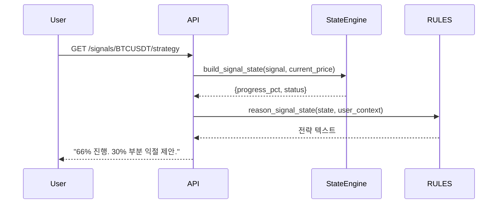

# Decker 시스템 흐름

---

## 데이터 흐름 (Mermaid)



---

## 시그널 → 전략 흐름



---

## 파이프라인 요약

```
시계열 데이터
    → [라벨링 알고리즘] → 라벨된 시그널
    → [State Engine] → progress_pct, status
    → [오퍼레이션 룰북] → 전략
    → Web / Telegram / API
```

---

## 참고

- [Architecture](../docs/architecture.md)
- [모델·알고리즘·성과](../docs/model.md)
