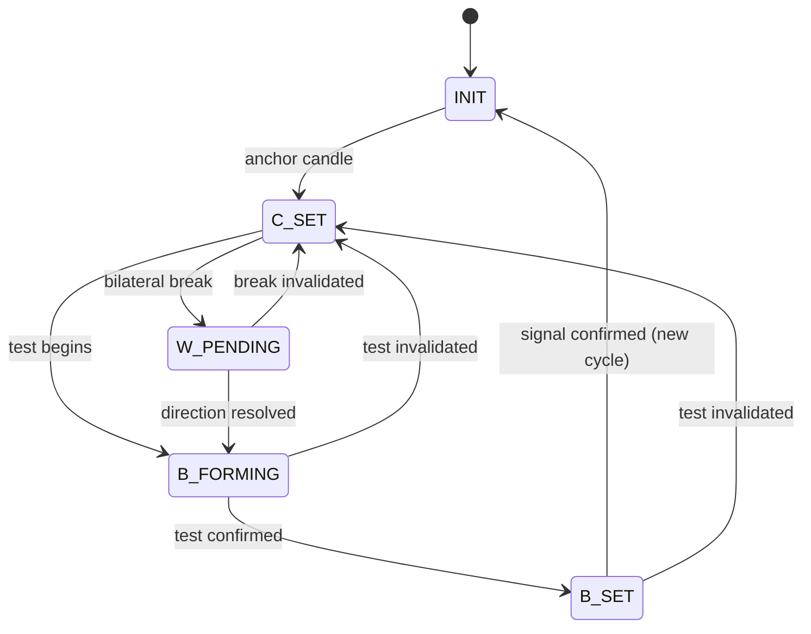
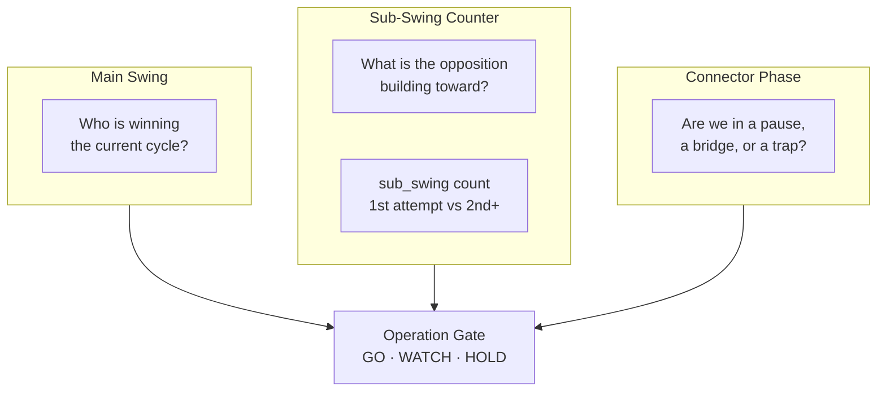
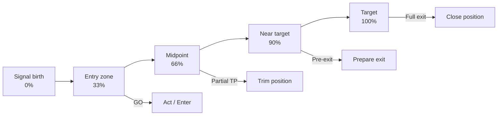
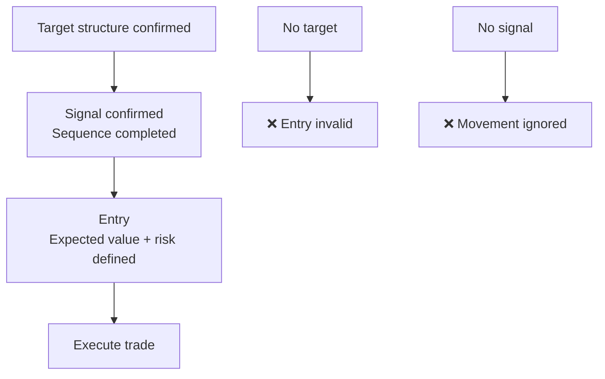
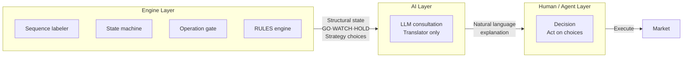

# Decker — System Flow Diagrams

Visual overviews of the Decker engine pipeline.

---

## Full Pipeline (Phase 4: Sequence Engine)

```mermaid
flowchart LR
    subgraph Input[Input]
        OHLCV[OHLCV Candles\nRaw market data]
        SigStore[Signal Store\njudgment_signals]
    end

    subgraph Label[1. Sequence Labeler]
        Role[Candle Role\nanchor / test / signal\nconnector / wide-break]
        Quality[Label Quality\nconfidence · stability\nregime consistency]
    end

    subgraph State[2. State Machine]
        FSM[5-State FSM\nINIT → C_SET\nB_FORMING → B_SET\nW_PENDING]
        Lanes[3-Lane Tracking\nmain · sub-swing · connector]
    end

    subgraph Gate[3. Operation Gate]
        GO[GO\nCycle complete]
        WATCH[WATCH\nTest in progress]
        HOLD[HOLD\nStructural risk]
    end

    subgraph Rules[4. RULES Engine]
        YAML[RULES.yaml\n9 layers · 30+ rules\nversion-controlled]
        Choices[Strategy + Choices\nranked action options]
    end

    subgraph Consult[5. AI Consultation]
        LLM[LLM as Translator\nnot decision-maker]
        NL[Natural language\nexplanation]
    end

    subgraph Output[Output]
        Web[Web]
        TG[Telegram\n@deckerclawbot]
        API[REST API]
    end

    OHLCV --> Role
    OHLCV --> Quality
    Role --> FSM
    Quality --> FSM
    FSM --> Lanes
    Lanes --> GO
    Lanes --> WATCH
    Lanes --> HOLD
    GO --> YAML
    WATCH --> YAML
    HOLD --> YAML
    YAML --> Choices
    SigStore --> YAML
    Choices --> LLM
    LLM --> NL
    NL --> Web
    NL --> TG
    Choices --> API
```

---

## The 5-State Machine



*Each transition is deterministic: same input → same output. Always.*

---

## Three Lanes (Simultaneous Tracking)



---

## Signal Lifecycle (progress_pct)



---

## Target → Signal → Entry



*Most systems: signal → entry (no target)*  
*Decker: target → signal → entry (target-first philosophy)*

---

## AI Layer Boundary



*The AI receives the engine's output and explains it. It never overrides it.*

---

## References

- [Sequence Engine concept](../concept/sequence_engine.md) — Full concept explanation
- [Architecture](../docs/architecture.md) — Module breakdown
- [Model & Performance](../docs/model.md) — Algorithm story and metrics
- [RULES.yaml](../operation_rules/RULES.yaml) — The open-source rulebook
- [Article Series Part 2](../docs/medium/part2/README.md) — Deep dives
