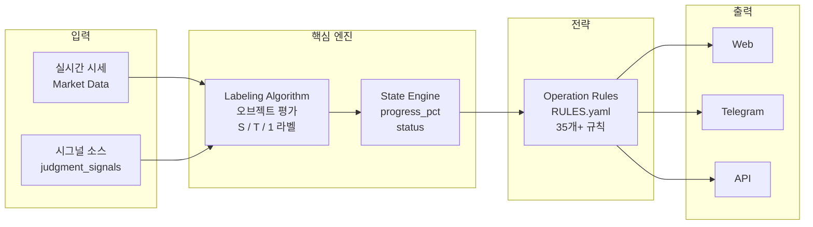
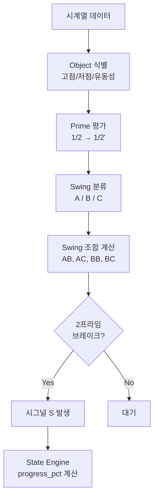
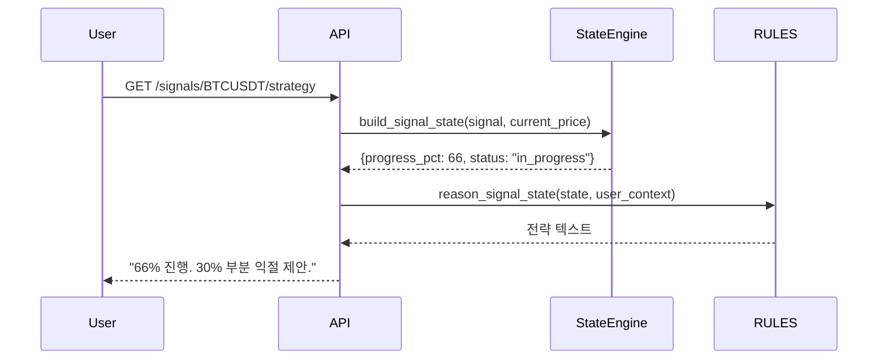
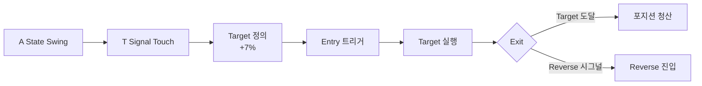
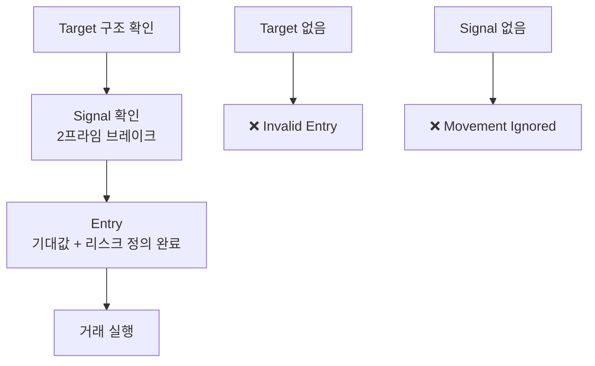

# Decker 시스템 흐름

---

## 전체 파이프라인

---

## 라벨링 → 시그널 발생 흐름

---

## 시그널 → 전략 시퀀스

---

## Trade Flow

---

## Target → Signal → Entry 원칙

---

## 참고

- [Architecture](../docs/architecture.md) — 파이프라인·모듈
- [모델·알고리즘·성과](../docs/model.md) — 성과 지표
- [라벨링 알고리즘](../concept/labeling_algorithm.md) — 오브젝트·스윙
- [Strategy DSL](../docs/strategy-dsl.md) — 사용자 정의 전략
